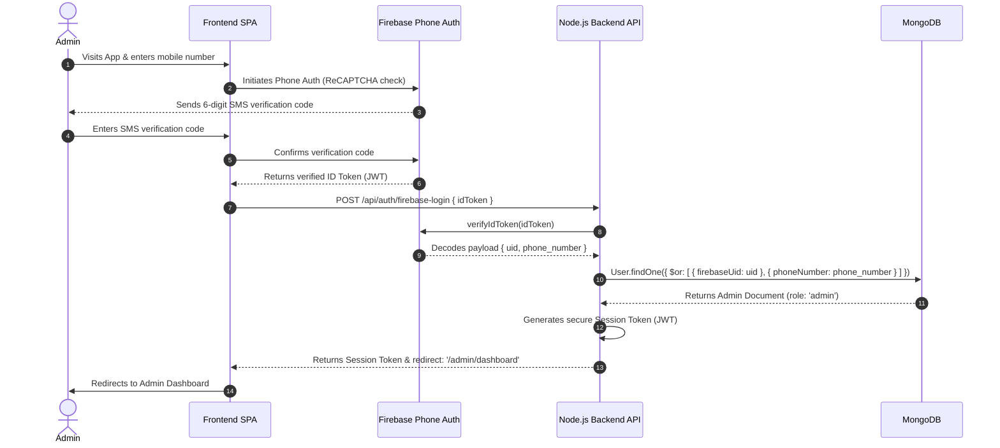
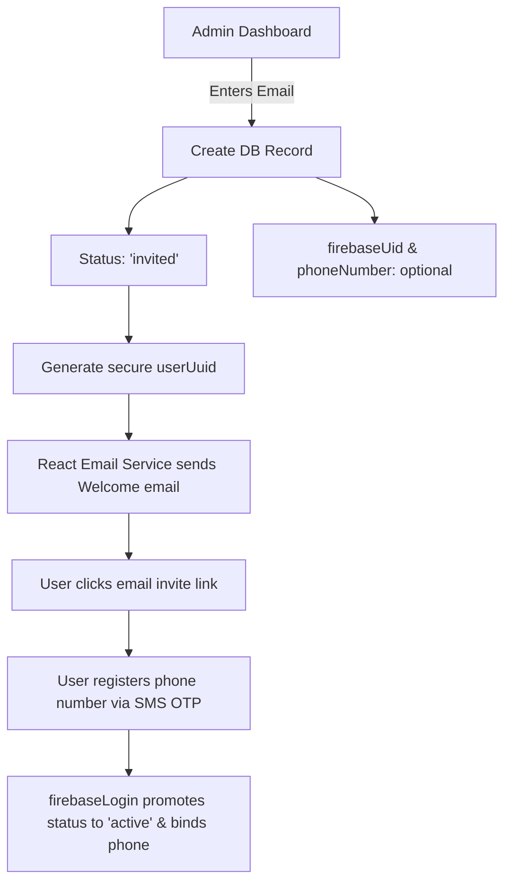

# Production Admin Management & User Invitation Playbook

This document details the exact technical flow for **Admin Bootstrapping**, **Secure Authentication**, **User Invitations**, and **User Moderation** on the Shaadi Mantrana platform in a production environment, including integration with Firebase Phone OTP.

---

## 🏛️ 1. Bootstrapping Admin IDs in Production

For security reasons, the database does not permit direct signup of administrator accounts. Admins are created using an explicit database-first elevation model.

### Phase A: Normal Phone Signup
1. The target admin first signs up using the standard mobile application or web page using their phone number. 
2. This creates their primary Firebase UID and standard database record in MongoDB as a `user` role with an `active` status.

### Phase B: Elevating to Admin via Mongoose CLI
A production script is supplied at `backend/scripts/promote-to-admin.js` to elevate any user account to `admin` securely.

1. SSH into the production server or open a secure terminal session inside the hosting console (e.g., Render/AWS).
2. Set the strict environment override flag (`FORCE_PROMOTE_ADMIN=true`) along with the production database connection string.
3. Run the promotion script with the admin's email or registered email:
   ```bash
   FORCE_PROMOTE_ADMIN=true NODE_ENV=production node backend/scripts/promote-to-admin.js admin_email@domain.com
   ```
4. Confirm the interactive prompt. The script directly sets `role = 'admin'` in MongoDB.

---

## 🔑 2. Admin Authentication Flow (Firebase Phone OTP Integration)

Now that the email/password auth pathways have been deprecated in favor of compliant Firebase authentication, **Admins login via the identical highly-secure Phone OTP flow as standard users.**



### Step-by-Step Production Login:
1. **Requesting Code**: The admin visits the main portal, enters their mobile number, and passes the background invisible reCAPTCHA check.
2. **Firebase OTP**: Firebase triggers an authentic SMS OTP directly to their phone.
3. **Frontend Exchange**: The admin inputs the code. The frontend's `confirmPhoneCode` resolves the code via the Firebase Client SDK and retrieves a short-lived Firebase `idToken`.
4. **Backend Token Exchange**: The frontend makes a POST request to `/api/auth/firebase-login` with the token.
5. **Backend Authentication**:
   - The backend `firebaseLogin` controller decodes the token using the official `firebase-admin` SDK.
   - It performs a search in MongoDB across `firebaseUid` and `phoneNumber`.
   - Once it matches the user record, it reads the custom `role` property.
6. **Dashboard Routing**: Since `role === 'admin'`, the server establishes a secure cookie-based JWT session and responds with `{ redirectTo: '/admin/dashboard' }`. The browser is instantly routed to the protected administration dashboard.

---

## 📧 3. How Admins Invite Users in Production

Shaadi Mantrana operates on an **invite-only pre-approval model** for supreme matchmaking exclusivity. 



### Step-by-Step Invitation Mechanics:

1. **Dashboard Dispatch**: The Admin enters the guest's email address on the Admin Dashboard (`/admin/users`).
2. **Database Inception**:
   - The backend creates a new Mongoose user document inside `User.js` with:
     ```javascript
     status: 'invited',
     email: 'invited_user@gmail.com',
     isApprovedByAdmin: true // Approved by default because created by admin
     ```
   - **Crucial Schema Rule**: Because `status === 'invited'`, Mongoose's conditional schema validators skip the required constraints for `phoneNumber` and `firebaseUid`, permitting a clean email-only creation step.
3. **Secure Transactional Email**:
   - The system initiates `inviteEmailService.js`.
   - This service utilizes `reactEmailService.js` to compile a stunning, branded HTML invitation using **React Email templates**.
   - It dispatches the email via SMTP/Resend containing a unique registration token:
     `https://shaadimantrana.com/?invite={userUuid}&email=invited_user@gmail.com`
4. **User Acceptance & Account Promotion**:
   - The guest opens the invitation link. The application reads the parameters from the URL query strings.
   - The guest registers their phone number through Firebase Phone Auth.
   - Upon successful phone confirmation, the backend `firebaseLogin` endpoint detects an existing record in MongoDB matching the user's `email`.
   - The backend automatically:
     - Saves their Firebase `uid` into `firebaseUid`.
     - Binds their confirmed `phoneNumber`.
     - Promotes their account status from `'invited'` to `'active'`.

---

## 🚦 4. Admin Approvals & Moderation Operations

Once a user is registered and active, the Admin maintains full compliance and safety oversight directly from the dashboard:

### A. Suspending & Pausing Accounts
Admins can pause accounts instantly when issues are flagged:
- **API Endpoint**: `POST /api/admin/users/:userId/pause`
- **Effect**: Changes `status = 'paused'` and sets `isApprovedByAdmin = false`. Paused users are excluded from standard matchmaking pools and discovery feeds.

### B. Resuming & Approving Accounts
- **API Endpoint**: `POST /api/admin/users/:userId/resume`
- **Effect**: Restores `status = 'active'` and sets `isApprovedByAdmin = true`.

### C. Play Store Compliant Photo Moderation
To adhere strictly to Google Play Store guidelines, user-uploaded profile pictures are created with `photoStatus: 'pending'` by default:
- Admins review all images inside the image moderation panel.
- Admins approve or reject images, changing `photoStatus` to `'approved'` to publish them to search pools.

---

## 🧪 5. Firebase Phone Auth Testing Mode & SMS Troubleshooting

When Testing Mode is active in the frontend build, the client-side Firebase SDK bypasses ReCAPTCHA and sends a dummy captcha token (e.g., `"NO_RECAPTCHA"`) to Google's backend.

### Test Numbers vs. Real Numbers

* **Pre-configured Test Phone Numbers**: If you use a pre-configured test phone number (defined in your Firebase Console), Google's backend accepts the dummy token and lets you log in instantly using the pre-configured OTP.
* **Real, Non-Test Phone Numbers**: If you use a real, non-test phone number (like `+917086875013`), Google's backend refuses to send a real SMS because the ReCAPTCHA token is dummy (`MALFORMED`). This prevents automated bots from draining your SMS quota.

---

### 🛠️ How to Resolve This (Choose Option A or B)

#### 📋 Option A: Add your phone number as a Test Number (Fastest & Free)
If you want to keep testing mode enabled (bypassing ReCAPTCHA to log in instantly), you can register your phone number as a test number:
1. Go to your **Firebase Console**.
2. Navigate to **Authentication** ➔ **Sign-in method** ➔ **Phone**.
3. Expand the **Phone** provider settings and locate the section **"Phone numbers for testing (optional)"**.
4. Add your phone number `+917086875013` and set a custom verification code (e.g., `123456`).
5. Save changes.
6. Try logging in again—you can now log in instantly on `https://www.shaadimantrana.live` using your number and the code `123456`!
*(You can also use the existing configured test number: `+919354799303` with OTP `123456`)*.

#### 📲 Option B: Enable Real SMS Sending (For Production Rollout)
If you want the site to send a real SMS verification code to actual mobile devices:
1. Go to your **Vercel Dashboard** for the frontend project.
2. Navigate to **Settings** ➔ **Environment Variables**.
3. Change `NEXT_PUBLIC_ENABLE_DEBUG` to `false` (or delete it if it defaults to `false`).
4. Redeploy the frontend to Vercel.
*(This will disable Testing Mode. The frontend will now load the real ReCAPTCHA widget to verify human interaction and successfully trigger a real SMS to your phone number)*.

---

## Section 6: Fixing `api.shaadimantrana.live` TLS Certificate

### 🔍 Problem Summary
The SSL/TLS certificate for our custom Render API subdomain `api.shaadimantrana.live` was stuck on "Pending" status in the Render Dashboard, even though the domain ownership itself was successfully "Verified" via our DNS settings.

### 🛠️ Investigation & Root Causes
Through live DNS lookups and configuration audits, we discovered three overlapping issues that were blocking Render from issuing the certificate:

1. **Mixed Nameservers (DNS Split)**:
   The domain `shaadimantrana.live` had conflicting nameservers configured at the registrar (Name.com). It was pointing to both `name.com` AND `ns2.vercel-dns.com` nameservers, leading to inconsistent DNS query responses.
   
2. **Subdomain Interference in Vercel**:
   Vercel's dashboard for the frontend project still had `api.shaadimantrana.live` registered as a domain with an "Invalid Configuration" status.
   
3. **ACME Certificate Interception**:
   Because Vercel was active for `api.shaadimantrana.live`, it was intercepting the HTTP-01 ACME challenge requests sent by Render's Let's Encrypt validation process, causing Render's cert generation to fail.

### 💡 The Resolution Steps
We executed the following steps to establish a clean, standard DNS architecture:

1. **Cleaned Registrar Nameservers**:
   Updated the registrar configuration on Name.com to point **strictly** to Name.com's default nameservers. Removed all Vercel nameservers from the main domain registrar settings.
   
2. **Released Subdomain Claim in Vercel**:
   Deleted the `api.shaadimantrana.live` subdomain entry entirely from the Vercel project configuration, freeing the domain from Vercel's control.
   
3. **Configured Correct DNS Records at Registrar**:
   Maintained a clean CNAME record inside Name.com pointing `api.shaadimantrana.live` directly to `shaadi-mantrana.onrender.com`.
   
4. **Triggered Render Verification**:
   Re-verified the custom domain within Render, allowing the Let's Encrypt ACME challenges to route cleanly to Render and successfully issue the TLS certificate.

### 📋 Clean Final DNS State

| Domain | Provider | Status | Role |
| :--- | :--- | :--- | :--- |
| `www.shaadimantrana.live` | Vercel | ✅ Valid / SSL Active | Production Frontend (Next.js) |
| `www.shaadimantrana.app` | Vercel | ✅ Valid / SSL Active | Alternative Frontend Alias |
| `api.shaadimantrana.live` | Render | ✅ SSL Active / CNAME Active | Production Backend API (Express/Mongo) |
